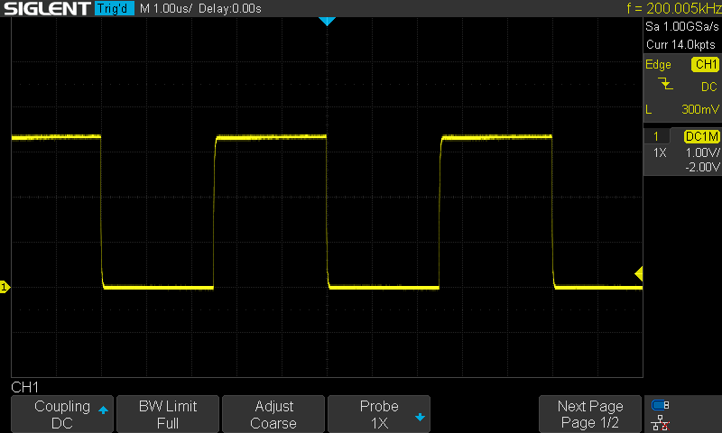

# Accelerometer

## Overview

Using the on-chip ADC for a SAMD21 microcontroller, record and transfer readings from a high-bandwidth accelerometer (ADXL-100x).

### SAMD21 ADC Characteristics

* 350ksps
* 12-bit resolution
* single-ended or differential

## Design

To maximize throughput, the ADC should be operated in free-running mode. In this mode, each conversion can be completed in 6 clock cycles, and the maximum clock frequency for the ADC is 2.1MHz (2100kHz). The clock for the ADC peripheral is provided by the SAMD21's generic clock controller (GCLK). This must be configured first.

### SAMD21 Clock System

Reference: https://blog.thea.codes/understanding-the-sam-d21-clocks/

* When connected to USB, the system clock is synchronized to the USB 1kHz frame start message, giving an accurate 48MHz clock in DFLL mode.
* Create a peripheral clock on GCLK5 using the 48MHz DFLL clock as a source
* GCLKs can be configured with a divider to scale the output frequency: an 8-bit DIV field is set in the GENDIV register
* There are two clock divider modes that can be configured for a GCLK using the DIVSEL field of the GENDIV register
  * DIVSEL=0: direct scaling with DIV cycles of the source clock equivalent to one ouput cycle from the GCLK (DIV=0 or 1 is equivalent to passing the source clock)
  * DIVSEL=1: DIV is interpreted in powers of 2 to scale the source clock

When initializing a GCLK, disable the GCLK first by clearing the enable flag in GENCTRL and CLKCTRL 

* GENCTRL controls clock generation
* CLKCTRL controls generated clock distribution

```c
#define GCLK_ID 5

GCLK->GENCTRL.reg = GCLK_GENCTRL_SRC_DFLL48M | GCLK_GENCTRL_ID(GCLK_ID);  // disable
GCLK->CLKCTRL.reg = GCLK_GENCTRL_ID(GCLK_ID);  //disable
while (GCLK->STATUS.bit.SYNCBUSY);
```

##### Clock Division Example 1

* Input clock frequency: 48MHz
* DIV = 240, DIVSEL = 0 (direct)
* Output clock frequency = 48MHz/240 = 200kHz

##### Clock Division Example 2

* Input clock frequency: 48MHz
* DIV = 8, DIVSEL = 1 (pow2)
* Output clock frequency = 48MHz/512 = (48000000 >> (8+1)) = 93.75kHz

```c
uint32_t reg_val = GCLK_GENCTRL_GENEN | GCLK_GENCTRL_SRC_DFLL48M | GCLK_GENCTRL_ID(GCLK_ID);
if (clk_divsel == GCLK_DIVSEL_POW2) {
  reg_val |= GCLK_GENCTRL_DIVSEL;
}
if (en_gclk_io) {
  reg_val |= GCLK_GENCTRL_OE;
} 
GCLK->GENCTRL.reg = reg_val;    
while (GCLK->STATUS.bit.SYNCBUSY);  
```

#### GCLK Output to Pin

The GCLK can be output to pin, which is useful to test on an oscilloscope. This requires

* The output enable (OE) flag be set in the GENCTRL register (see conditional on  `en_gclk_io`  in the code above)
* The pin be configured for output using the SAMD21's port multiplexing. This requires knowing which IO pin (not the physical pin) to target and selecting the correct peripheral multiplexing type (H for GCLK)

 ##### GCLK Output Example

Using PA11 as the target (Arduino pin 8/SCK on the Adafruit QT Py board).

```c
int const iopin = 11;
PORT->Group[PORTA].DIRSET.reg = (1 << iopin);     // output PA11
PORT->Group[PORTA].PINCFG[iopin].bit.PMUXEN = 1;  // enable peripheral mux 
PORT->Group[PORTA].PMUX[iopin >> 1].reg = PORT_PMUX_PMUXE_H | PORT_PMUX_PMUXO_H;  // type H
```

In the code block from the previous section, the `GCLK_GENCTRL_OE` flag is set to enable output when configuring the GCLK. This generates a clock output on a pin on the QT Py board, which is plotted in the oscilloscope image below (DIV=240, DIVSEL=0, fclk=200kHz)



### SAMD21 ADC Configuration

Using the GCLK configured in the previous section, the next step is to configure the ADC in free-running mode. This requires

* configure the IO pin in the port multiplexer to direct input to the ADC
* connect the GCLK to the ADC
* configure the ADC

#### IO Pin Configuration

On the QTPy board, the Arduino A0 pin maps to the SAMD21 PA02 IO pin. Mux type B is used for the ADC

```C
int const iopin = 2;
PORT->Group[PORTA].DIRCLR.reg = (1 << iopin);     // input PA02
PORT->Group[PORTA].PINCFG[iopin].bit.PMUXEN = 1;  // enable peripheral mux 
PORT->Group[PORTA].PMUX[iopin >> 1].reg = PORT_PMUX_PMUXE_B | PORT_PMUX_PMUXO_B; // B -> ADC
```

#### Connecting GCLK to ADC

Connect the GCLK to the ADC peripheral using the GCLK CLKCTRL register and enable the distribution of that clock. Here  `genclk_id`  is the bit-shifted GCLK identifier (0-8) in the GEN[3:0] field of the CLKCTRL register (there is a macro defined, e.g. `GCLK_CLKCTRL_GEN_GCLK5`. 

```C
GCLK->CLKCTRL.reg = (GCLK_CLKCTRL_CLKEN | genclk_id | GCLK_CLKCTRL_ID_ADC);
while (GCLK->STATUS.bit.SYNCBUSY);
```

#### Configure the ADC

For this application

* Use the internal reference VCC/2 in combination with DIV2 gain to use the full VCC range
* Don't use averaging or repeated sampling to gain extended precision
* Set the negative input of the ADC to ground (single ended measurement)
* Use the lowest prescaler setting (DIV4) to generate the ADC clock from the input GCLK
* Operate the ADC at 12-bit resolution in free-running mode
* Enable interrupts on conversion complete

##### Clock Rate Considerations

The ADC includes an internal prescaler with a minimum clock division of 4. To operate the ADC at it's maximum sample rate, the GCLK input should be 4 x 2.1MHz = 8.4MHz (the closest internal clock that can be generated from the 48MHz source would be DIV=6: 8MHz). 

The minimum ADC clock rate is defined as 30kHz: the input clock would be 120kHz with the DIV4 prescaler setting and the sample rate would be 5ksps in free-running mode (6 cycles per conversion). Below this rate, single shot conversions are required or multiple conversions can be accumulated or averaged. 

##### USB Transfer Rate Considerations

The USB1.1 data transfer rate is 12Mbps. This is a raw data rate, and in practice transfers will be slower. Assuming two byte words, data rates below 500kwps are expected. The USB transfers are hidden behind the serial port interface for the Arduino boards. Not tested.


